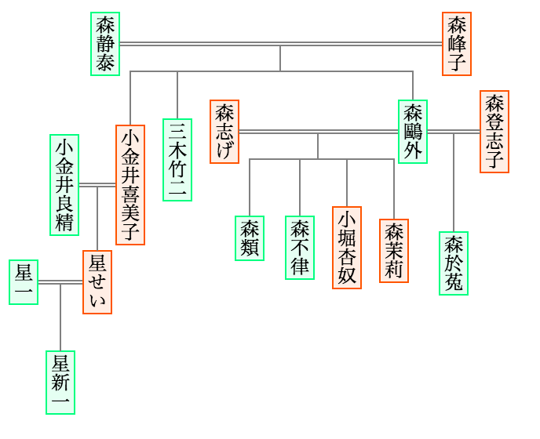
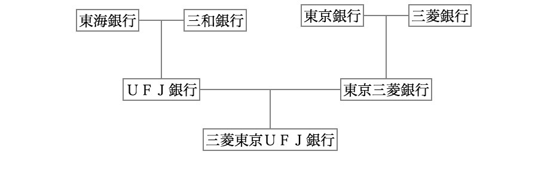

# Draw a pedigree chart in SVG format
# 系図を描いて SVG データにしてみよう

## Brief Description
[This drawing tool](https://piyo-ko.github.io/pedigree/pedigree-en.html) allows you to draw a pedigree chart (i.e., family tree chart) free from taking care of the size of the area (or the size of the sheet of paper) where the chart is to be embedded.  You can draw your chart as you like (however large the chart may become), and then scale the chart as you need.  The scaling does not degrade the chart's image quality because Scalable Vector Graphics (SVG) format is scalable, of course. 

A pedigree chart in SVG format is good in that:

* it can be easily reused in different sizes, 
* the file size of it is relatively small, 
* it can be manually edited by using any text editor, 
* the style applied to the chart can be easily customized by editing [the Cascading Style Sheet (CSS) file used](https://piyo-ko.github.io/pedigree/pedigree_svg.css), and 
* many application programs (including Web browsers) support SVG format.

Two simple example charts are shown below (precisely speaking, they are Portable Network Graphics (PNG) images converted from original images in SVG format).  Links to other examples are [listed on another page](https://piyo-ko.github.io/fun/pedigree_examples_index.html).  Although Chinese/Japanese characters (not Latin characters) are used in these charts, you will still see that how complex chart can be created by using [this drawing tool](https://piyo-ko.github.io/pedigree/pedigree-en.html). 

Please do not hesitate to contact me on GitHub (`@piyo-ko`) or on Twitter (`@pi__yo__ko`).

## 簡単な紹介
系図がほしい状況は色々あるはずだが、自分で作ろうとなると、まずどのソフトウェアで作れば良いのかに悩む。しかも、作図している途中では全体像が見えにくいこともあるので、途中で「全体的に各要素を縮小したい (そうしないと所定の範囲に系図を収められない)」となるかもしれないが、ソフトウェアによっては、その作業が煩雑を極める可能性もある。

そこで、「SVG ならスケーラブルだし、後でテキストエディタで微調整も好きにできるし、再利用性も良さそうだし、系図作りに良いのでは?」と思いついて、その単なる思いつきのままに、行き当たりばったりで系図作成アプリ的なものを作ってみた。

* [実際に系図を作るページ](https://piyo-ko.github.io/pedigree/pedigree.html)
* 作った SVG ファイルと同じフォルダに置くべき[スタイルファイル](https://piyo-ko.github.io/pedigree/pedigree_svg.css)
* [技術的なメモ](https://piyo-ko.github.io/pedigree/attributes.html)

御感想などは Twitter で `@pi__yo__ko` までどうぞ。

## 例
[PNG への変換ページ](https://piyo-ko.github.io/tools/svg2png.html) で変換した画像 (背景色として白を指定したもの) を二つ、例として載せておく。

作成した系図の[一覧ページ](https://piyo-ko.github.io/fun/pedigree_examples_index.html)も作った。

## 今後の課題

予定は未定だし、対処できるかどうかも分からないが、一応、残っている課題・思いつく課題を挙げておく。

* 縦書きの場合は左側に、横書きの場合は下側に、任意の行数の注釈を追加できるようにしてあるが、右側・上側も選べたら嬉しいかもしれない (人名にルビを振るといった用途に使えそう)。
* 源氏物語や日本の古代・中世のような複雑な系図を作ろうとすると対処しきれない場合がある問題 (今は対処しきれない問題が発生すると、「どう再描画すれば良いか分からない」線の色を赤くするだけで放置している)。
* 誰かを基準にして位置合わせをする整列機能は作ってみたが、等間隔に並べるといった別種の整列機能が更にあると嬉しいかも。
* プログラムが全体的に行き当たりばったりなので、もう少し小綺麗にしたい。
* ヘルプページは必要だろうか?

以上。
